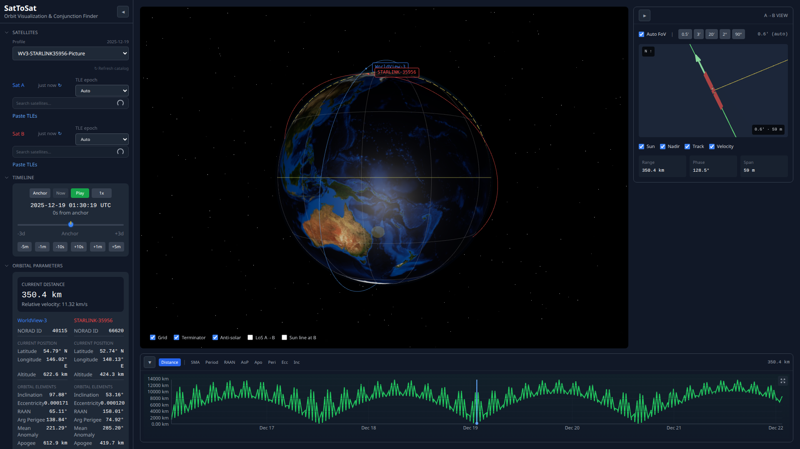
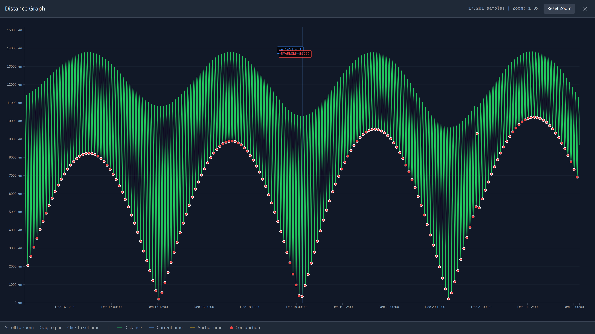

# SatToSat

A satellite orbit visualization and conjunction analysis tool. Select two satellites to visualize their orbits in 3D and find close approaches between them.



## Features

<a id="features"></a>

### 3D Globe Visualization

<a id="3d-globe"></a>
- Interactive 3D Earth with realistic lighting and day/night terminator
- Real-time satellite position display with orbit tracks
- Camera controls for rotation, zoom, and pan
- Toggle grid, terminator, anti-solar point, and sun line overlays

### Conjunction Analysis

<a id="conjunction-analysis"></a>

- Automatic detection of close approaches between satellite pairs
- Searches ±3 days from anchor time with 30-second resolution
- Ternary search refinement to 100ms precision for exact closest approach times
- Displays distance, relative velocity, phase angle, and Earth relation for each conjunction

### Distance Timeline

<a id="distance-timeline"></a>

- Interactive graph showing inter-satellite distance over the search window
- Click anywhere to jump to that time
- Hover for precise time and distance values
- Expand to fullscreen for detailed analysis



The fullscreen graph provides:
- High-resolution sampling (~17,000 points over 6 days)
- Mouse wheel zoom (1x to 50x)
- Click-and-drag panning
- Conjunction points marked with red circles
- Current time (blue) and anchor time (yellow) markers

### Relative View (A → B)

<a id="relative-view"></a>

- 3D visualization of Satellite B as seen from Satellite A
- North-up orientation with celestial reference
- Field of view presets: 0.5′, 3′, 20′, 120′, or auto-fit
- Sun direction indicator and velocity vector display
- Relative orbit track projection

### Orbital Parameters
- Side-by-side comparison of both satellites' orbital elements
- Displays: altitude, inclination, eccentricity, RAAN, argument of perigee, mean anomaly, apogee, perigee
- Current lat/long position for each satellite
- Real-time distance and relative velocity

### Pre-configured Profiles
- Built-in scenarios with interesting satellite pairs
- Embedded TLE history for offline analysis
- One-click loading of anchor time and satellite selection

### TLE Management
- Automatic TLE fetching from Celestrak
- Intelligent epoch selection (uses TLE closest to target time)
- Local caching with 24-hour TTL
- Paste custom TLEs for any satellite

## Technology Stack

- **React** + **TypeScript** - UI framework
- **Three.js** via **@react-three/fiber** - 3D rendering
- **D3.js** - Interactive charting for fullscreen distance graph
- **satellite.js** - SGP4/SDP4 orbit propagation
- **Tailwind CSS** - Styling
- **Vite** - Build tooling

## Getting Started

### Prerequisites
- Node.js 18+
- npm

### Installation

```bash
# Clone the repository
git clone https://github.com/your-username/sattosat.git
cd sattosat

# Install dependencies
npm install

# Start development server
npm run dev
```

The app will be available at `http://localhost:5173`.

### Build for Production

```bash
npm run build
```

## Documentation

- **[UI Guide](USAGE_UI.md)** - Detailed instructions for the web interface
- **[Scripts Guide](USAGE_SCRIPTS.md)** - Command-line analysis tools documentation

## Quick Start

1. **Select Satellites**: Use the dropdown menus or search to select Satellite A and Satellite B
2. **Set Anchor Time**: The anchor time centers the ±3 day conjunction search window
3. **View Conjunctions**: Close approaches are automatically calculated and listed
4. **Explore Timeline**: Click the distance graph to jump to any time, or expand for detailed zoom/pan analysis
5. **Analyze Geometry**: Use the A → B relative view to understand the visual geometry of approaches

## Development

```bash
npm run dev      # Start dev server with hot reload
npm run build    # TypeScript check + production build
npm run lint     # ESLint with zero-warnings enforcement
npm test         # Run vitest tests
```

## Analysis Scripts

<a id="analysis-scripts"></a>

The repository includes Python and TypeScript scripts for conjunction analysis and verification. See **[USAGE_SCRIPTS.md](USAGE_SCRIPTS.md)** for complete documentation.

Quick examples:

```bash
# Find conjunctions using a profile (from python/ directory)
cd python && uv run python conjunctions.py --profile WV3-STARLINK35956-Picture

# Run envelope period analysis
cd python && uv run python envelope_analysis.py

# Verify Python vs TypeScript algorithm equivalence (within 27 meters)
python scripts/compare-conjunctions.py --verbose
```

Script categories:
- **[Conjunction Analysis](USAGE_SCRIPTS.md#conjunction-scripts)** - Find close approaches between satellites
- **[Envelope Period Analysis](USAGE_SCRIPTS.md#envelope-scripts)** - Study the rhythm of imaging opportunities
- **[Investigation Scripts](USAGE_SCRIPTS.md#investigation-scripts)** - Starlink-35956 discrepancy analysis
- **[Algorithm Verification](USAGE_SCRIPTS.md#algorithm-verification)** - Cross-validate Python and TypeScript implementations

## Data Sources

- Satellite catalog and TLEs from [Celestrak](https://celestrak.org/)
- Earth textures from NASA Blue Marble

## License

MIT
