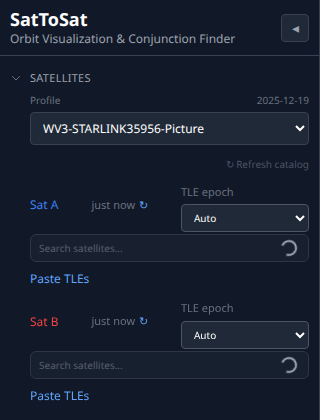
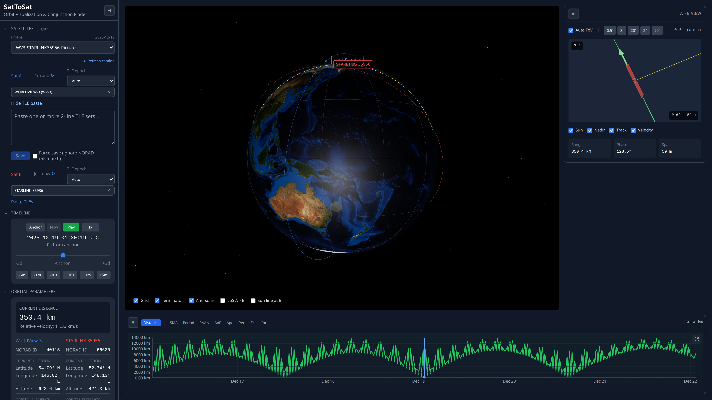
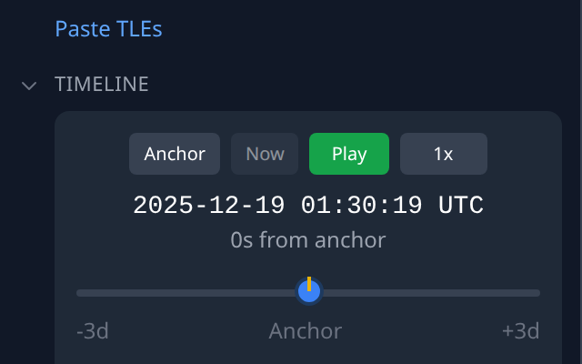
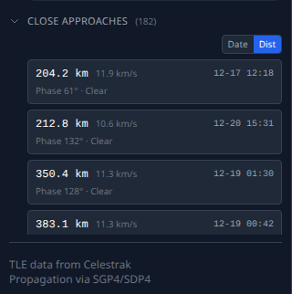
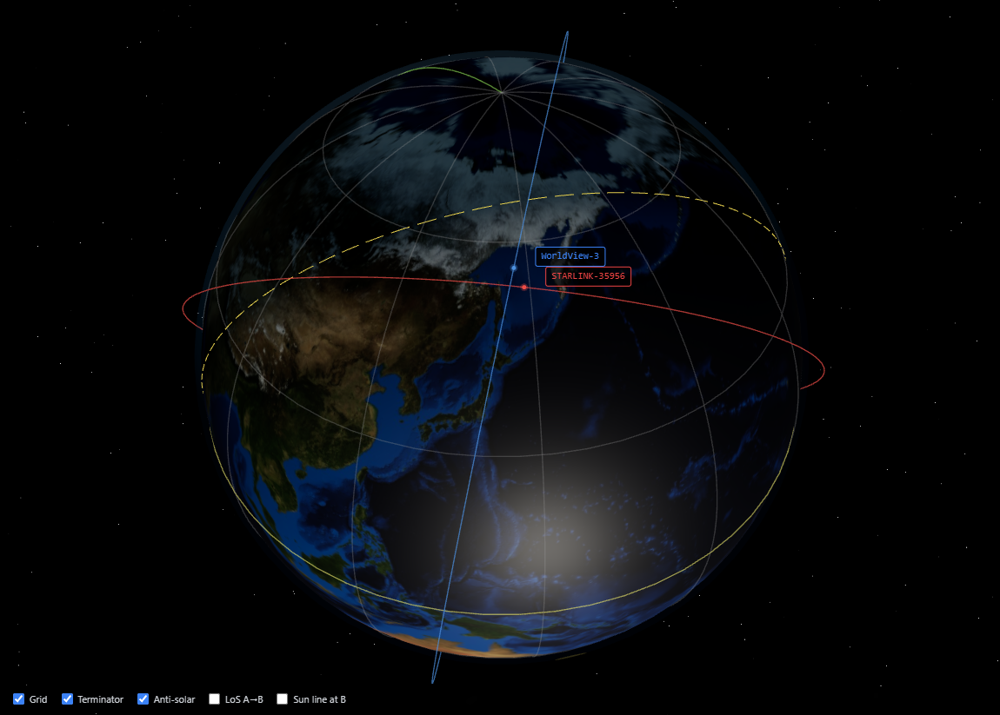
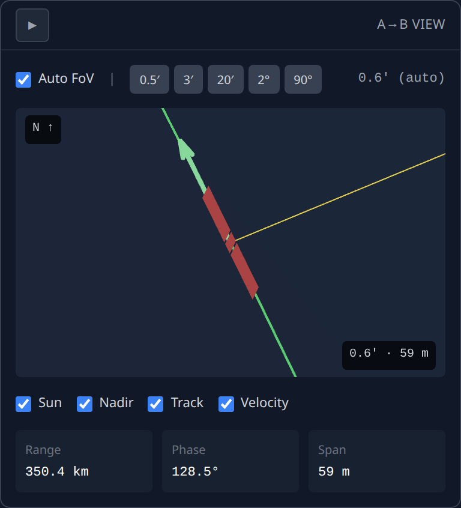
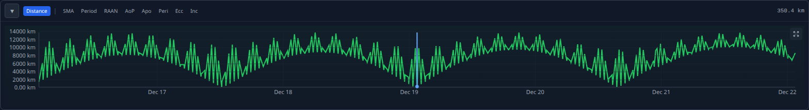
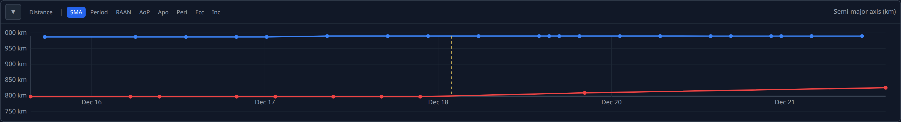
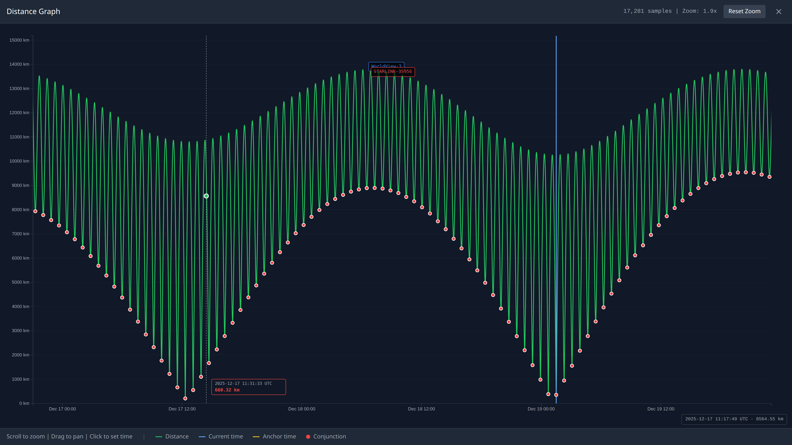

# SatToSat Usage Guide

This guide provides detailed instructions for using all features of SatToSat, a satellite orbit visualization and conjunction analysis tool.


## Table of Contents

1. [Satellite Selection](#satellite-selection)
2. [Profiles](#profiles)
3. [TLE Data Management](#tle-data-management)
4. [Timeline Controls](#timeline-controls)
5. [Orbital Parameters Panel](#orbital-parameters-panel)
6. [Close Approaches Panel](#close-approaches-panel)
7. [Main 3D View](#main-3d-view)
8. [A→B Relative View](#ab-relative-view)
9. [Bottom Panel Graphs](#bottom-panel-graphs)
10. [Fullscreen Distance Graph](#fullscreen-distance-graph)

---

## Satellite Selection



The satellite selection panel allows you to choose two satellites (Sat A and Sat B) for comparison and conjunction analysis.

### Selecting Satellites

- **Search Box**: Type a satellite name or NORAD ID to search the catalog
- **Sat A** (blue): The primary/reference satellite
- **Sat B** (red): The secondary/target satellite

### TLE Epoch Selection

Each satellite has a **TLE epoch** dropdown:

- **Auto**: Automatically selects the TLE with epoch closest to the anchor time (recommended)
- **Specific epoch**: Choose a particular TLE epoch from the available list

The epoch selector shows all TLE epochs available within the ±3 day search window. TLEs are most accurate near their epoch date, so the app automatically switches between epochs during propagation.

### Cache Information

- **"just now"**: Indicates when TLE data was last fetched
- **Refresh button (↻)**: Click to fetch the latest TLE from Celestrak

---

## Profiles

Profiles are pre-configured scenarios with satellite pairs, anchor times, and embedded TLE history.

### Using Profiles

1. Select a profile from the **Profile** dropdown
2. The app automatically:
   - Sets the anchor time to the profile's reference date
   - Loads both satellites
   - Seeds embedded TLE data for offline analysis

### Currently Available Profile

There is currently **one profile** in the codebase:

- **WV3-STARLINK35956-Picture**: WorldView-3 imaging satellite and a Starlink satellite close approach scenario from December 2025

When a profile is active, the anchor date is displayed next to the Profile label.

### Clearing a Profile

Select "-- None --" from the Profile dropdown to clear the profile and return to manual satellite selection.

---

## TLE Data Management

### Satellite Data Cache

SatToSat caches satellite data locally for performance:

- **Catalog cache**: Satellite catalog with 24-hour TTL
- **TLE cache**: Up to 50 TLE epochs per satellite
- **Refresh catalog**: Updates the entire satellite catalog from Celestrak

### Paste TLE Facility



You can manually add TLE data for any satellite:

1. Click **"Paste TLEs"** under the satellite selector
2. Paste TLE data in standard two-line or three-line format
3. Click **Add TLEs** to import

This is useful for:
- Adding historical TLEs not available from Celestrak
- Using TLEs from other sources
- Testing with custom orbital elements

**Supported formats:**
```
SATELLITE NAME
1 25544U 98067A   24001.50000000  .00000000  00000-0  00000-0 0  9999
2 25544  51.6400 123.4567 0001234  12.3456 347.8901 15.50000000000000
```

---

## Timeline Controls



The timeline section controls simulation time and playback.

### Time Display

Shows the current simulation time in UTC format: `YYYY-MM-DD HH:MM:SS UTC`

Below it shows the offset from anchor time (e.g., "0s from anchor", "+2h from anchor").

### Navigation Buttons

- **Anchor**: Jump to the anchor time (center of the search window)
- **Now**:
  - With profile: Jump to current real time (if within window)
  - Without profile: Reset anchor to current time
- **Play/Pause**: Start/stop automatic time progression

### Playback Speed

Click the speed button to cycle through: **1x → 10x → 100x → 1000x → 1x**

### Fine Time Controls

Quick jump buttons for precise navigation:
- **-5m / +5m**: Jump 5 minutes backward/forward
- **-1m / +1m**: Jump 1 minute backward/forward
- **-10s / +10s**: Jump 10 seconds backward/forward

### Time Slider

Drag the slider to scrub through the ±3 day window centered on the anchor time.

---

## Orbital Parameters Panel


Displays detailed orbital elements for both satellites side-by-side.

### Current Distance

- **Distance**: Current separation between Sat A and Sat B in kilometers
- **Relative velocity**: Closing/separation speed in km/s

### Satellite Information

For each satellite:
- **Name** and **NORAD ID**

### Current Position

- **Latitude/Longitude**: Ground track position
- **Altitude**: Height above Earth's surface in km

### Orbital Elements

- **Inclination**: Orbital plane angle relative to equator
- **Eccentricity**: Orbit shape (0 = circular, approaching 1 = elliptical)
- **RAAN**: Right Ascension of Ascending Node
- **Arg Perigee**: Argument of perigee
- **Mean Anomaly**: Position along the orbit
- **Apogee/Perigee**: Highest and lowest orbital altitudes

---

## Close Approaches Panel



Lists all detected conjunction events (close approaches) within the ±3 day search window.

### Conjunction Detection

The algorithm:
1. Scans at 30-second intervals across the time window
2. Detects local minima in the distance function
3. Refines each minimum to 100ms precision using ternary search
4. Automatically switches between TLE epochs for accuracy

### Conjunction List

Each entry shows:
- **Distance**: Closest approach distance in km
- **Time**: UTC timestamp of closest approach
- **Relative velocity**: Closing speed at closest approach

### Sorting

Toggle between:
- **Sort by distance**: Closest approaches first
- **Sort by date**: Chronological order

### Navigation

Click any conjunction to jump the simulation time to that moment.

### Loading Indicator

A spinning indicator appears while conjunctions are being calculated.

---

## Main 3D View



The central 3D globe visualization showing Earth, satellites, and their orbits.

### Earth Visualization

- Realistic day/night lighting based on current simulation time
- Day side shows land and ocean features
- Night side is darkened

### Satellite Display

- **Sat A** (blue marker): Primary satellite with blue orbit track
- **Sat B** (red marker): Secondary satellite with red orbit track
- Labels show satellite names

### Camera Controls

- **Left-click + drag**: Rotate the view
- **Right-click + drag**: Pan the view
- **Scroll wheel**: Zoom in/out
- **Double-click**: Reset view

### View Controls


Toggle overlays using the checkbox bar at the bottom:

- **Grid**: Show/hide latitude-longitude grid lines
- **Terminator**: Day/night boundary line (dashed)
- **Anti-solar**: Marker for the point directly opposite the Sun
- **LoS A→B**: Line of sight between satellites (cyan line)
- **Sun line at B**: Sun direction from Satellite B (yellow dashed line)

The LoS and Sun line options are only available when both satellites are selected.

---

## A→B Relative View



A specialized 3D view showing Satellite B as seen from Satellite A's perspective.

### View Orientation

- Camera positioned at Satellite A, looking toward Satellite B
- **North-up orientation**: The "N ↑" indicator shows celestial north is up
- Satellite B is rendered as a rectangular shape (30m × 4.1m typical satellite bus)

### Field of View (FoV) Controls

- **Auto FoV**: Automatically adjusts to keep Satellite B in view
- **Preset buttons**: 0.5′, 3′, 20′, 2°, 90° (arcminutes/degrees)
- **Current FoV**: Displayed on the right (e.g., "0.6' (auto)")

### Visual Elements

- **Green arrow**: Velocity vector of Satellite B
- **Yellow dashed line**: Direction to the Sun from B
- **Green line**: Relative orbit track of B around A
- **Cyan line**: Line of sight (when enabled)

### Overlay Toggles

- **Sun**: Show/hide Sun direction indicator
- **Nadir**: Show/hide Earth direction from B
- **Track**: Show/hide relative orbit track
- **Velocity**: Show/hide velocity vector

### Information Display

- **Range**: Current distance to Satellite B
- **Phase**: Sun-satellite-observer phase angle (important for optical observations)
- **Span**: Physical size of the current FoV at B's distance

### Playback Control

The play button in the top-left allows independent animation in this view.

---

## Bottom Panel Graphs



The bottom panel provides time-series graphs of various orbital parameters.

### Available Tabs

| Tab | Parameter | Description |
|-----|-----------|-------------|
| **Distance** | Inter-satellite distance | Separation between A and B over time |
| **SMA** | Semi-major axis | Orbital size parameter |
| **Period** | Orbital period | Time for one complete orbit |
| **RAAN** | Right Ascension of Ascending Node | Orbital plane orientation |
| **AoP** | Argument of Perigee | Orientation of orbit within its plane |
| **Apo** | Apogee altitude | Highest point in orbit |
| **Peri** | Perigee altitude | Lowest point in orbit |
| **Ecc** | Eccentricity | Orbit shape (circularity) |
| **Inc** | Inclination | Orbital plane tilt |

### Distance Tab


The default view showing inter-satellite distance:
- **Green curve**: Distance over the ±3 day window
- **Blue vertical line**: Current simulation time
- **Yellow dashed line**: Anchor time
- **Y-axis**: Distance in kilometers
- **X-axis**: Date with day boundaries marked

### Orbital Parameter Tabs



Other tabs show how orbital elements vary over time:
- **Blue line**: Satellite A's parameter
- **Red line**: Satellite B's parameter

This helps visualize:
- Orbital decay (decreasing SMA)
- Nodal regression (changing RAAN)
- Apsidal precession (changing AoP)

### Graph Interaction

- **Click**: Jump simulation time to that point
- **Hover**: Shows tooltip with exact time and value
- **Expand button** (⛶): Open fullscreen view (Distance tab only)

### Current Value Display

The current distance is shown in the top-right corner (e.g., "350.4 km").

### Collapse Button

Click the collapse button (▾) to minimize the bottom panel and maximize the 3D view.

---

## Fullscreen Distance Graph


A high-resolution, interactive distance graph with zoom and pan capabilities.

### Opening Fullscreen View

Click the expand button (⛶) in the top-right corner of the Distance tab.

### Graph Features

- **High-resolution sampling**: ~17,000 data points (30-second intervals)
- **Green curve**: Inter-satellite distance
- **Red circles**: Detected conjunction points (local minima)
- **Blue line**: Current time marker
- **Yellow dashed line**: Anchor time marker

### Zoom Controls



- **Mouse wheel**: Zoom in/out (1x to 50x)
- **Click and drag**: Pan the view when zoomed
- **Reset Zoom**: Button to return to 1x view

### Information Display

- **Sample count**: Shows number of data points (e.g., "17,281 samples")
- **Zoom level**: Current magnification (e.g., "Zoom: 2.5x")

### Conjunction Points

Red circles mark each detected close approach. These are computed separately from the curve sampling to ensure accuracy—the curve's high sample rate ensures visual continuity, while conjunction detection uses precise numerical methods.

### Legend

Bottom bar shows:
- Distance (green line)
- Current time (blue line)
- Anchor time (yellow dashed)
- Conjunction points (red circles)

### Navigation

- **Click anywhere on the graph**: Jump simulation time to that point
- **Escape key**: Close fullscreen view

---

## Tips and Best Practices

### For Conjunction Analysis

1. **Select a profile** or manually choose satellites of interest
2. **Set the anchor time** to center your search window
3. **Review the Close Approaches panel** for detected conjunctions
4. **Click a conjunction** to jump to that time
5. **Use the A→B view** to understand the geometry
6. **Open the fullscreen graph** for detailed distance analysis

### For Orbital Visualization

1. **Use view controls** to toggle overlays as needed
2. **Rotate the globe** to see orbits from different angles
3. **Check orbital parameters** to understand the dynamics
4. **Use parameter tabs** to see how elements change over time

### For Historical Analysis

1. **Load a profile** with embedded historical TLEs
2. **Or paste TLEs** from historical sources
3. **Select specific TLE epochs** if needed for precision
4. **Use the timeline** to scrub through the event
